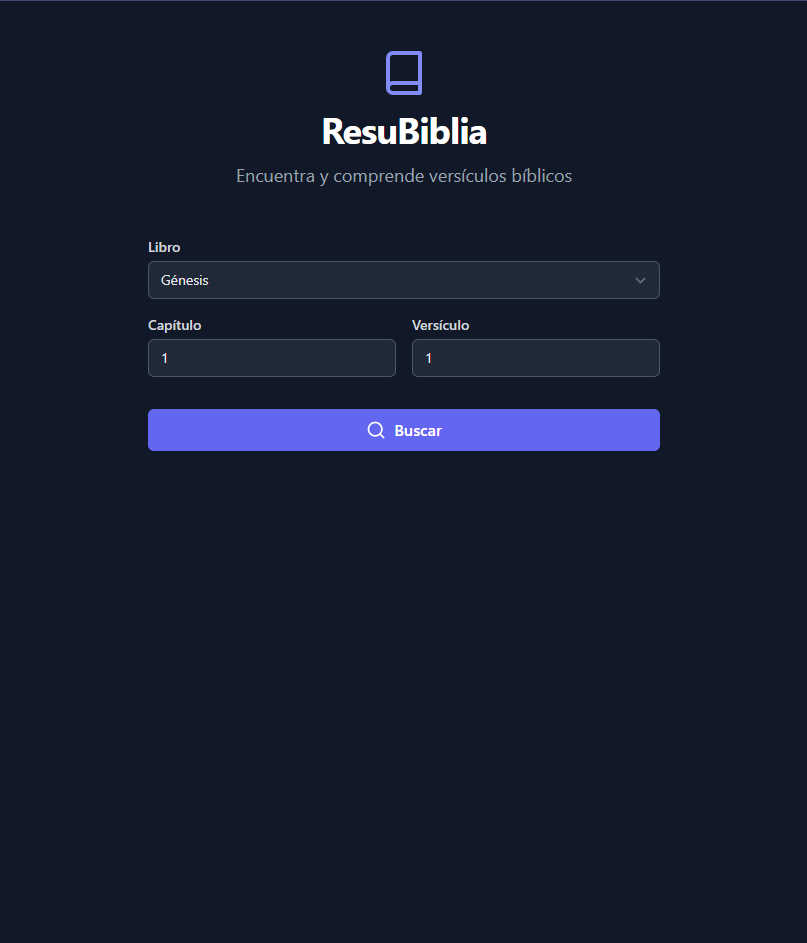
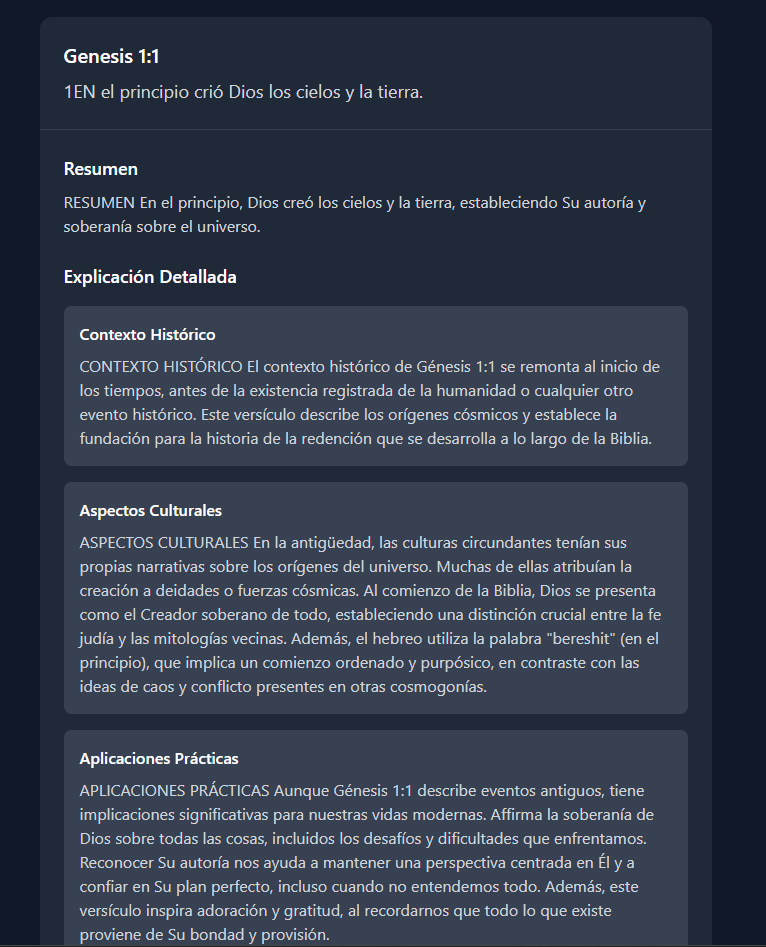

# 📖 ResuBiblia

<div align="center">


[](https://reactjs.org/)
[](https://www.typescriptlang.org/)
[](https://tailwindcss.com/)
[](https://vitejs.dev/)

_Una aplicación moderna para explorar y comprender versículos bíblicos en múltiples idiomas_

[🌐 Ver Demo](https://warm-piroshki-8a584b.netlify.app/) • [📝 Reportar Bug](https://github.com/JesusACD/resubiblia/issues) • [✨ Solicitar Función](https://github.com/JesusACD/resubiblia/issues)

</div>

## ✨ Características

🌍 **Soporte Multilingüe**
- Interfaz en 5 idiomas: Español, Inglés, Portugués, Árabe y Chino
- Nombres de libros traducidos
- Soporte RTL para árabe

🔍 **Búsqueda Inteligente**
- Búsqueda por libro, capítulo y versículo
- Resultados instantáneos
- Interfaz intuitiva

🤖 **Análisis con IA**
- Resumen conciso del versículo
- Contexto histórico detallado
- Aspectos culturales relevantes
- Aplicaciones prácticas modernas

💫 **Experiencia de Usuario Premium**
- Diseño responsivo y moderno
- Animaciones suaves
- Modo oscuro (próximamente)

## 🚀 Inicio Rápido

1. **Clona el repositorio**
   ```
   git clone https://github.com/JesusACD/resubiblia.git
   cd resubiblia
   ```

2. **Instala las dependencias**
   ```
   npm install
   ```

3. **Configura las variables de entorno**
   
   ```
   cp .env.example .env
   # Edita .env con tus claves API
   ```

4. **Inicia el servidor de desarrollo**
   ```
   npm run dev
   ```

## 🛠️ Tecnologías

- **Frontend**: React + TypeScript
- **Estilos**: Tailwind CSS
- **Empaquetador**: Vite
- **APIs**: 
  - Scripture API (versículos)
  - GROQ API (análisis IA)

## 📱 Capturas de Pantalla

<div align="center">
<table>
<tr>
<td>
<strong>Búsqueda de Versículos</strong><br>

</td>
<td>
<strong>Análisis Detallado</strong><br>

</td>
</tr>
</table>
</div>

## 🤝 Contribuir

¡Las contribuciones son bienvenidas! Por favor, lee nuestra [guía de contribución](CONTRIBUTING.md) antes de enviar un PR.

1. Fork el proyecto
2. Crea tu rama de función (\`git checkout -b feature/AmazingFeature\`)
3. Commit tus cambios (\`git commit -m 'Add: Amazing Feature'\`)
4. Push a la rama (\`git push origin feature/AmazingFeature\`)
5. Abre un Pull Request

## 📄 Licencia

Este proyecto está bajo la Licencia MIT

## 🙏 Agradecimientos

- [Bible API](https://scripture.api.bible/) por proporcionar acceso a los versículos
- [GROQ](https://groq.com/) por el análisis de IA


<div align="center">

Hecho con ❤️ por [JesusACD](https://github.com/JesusACD)

</div>
